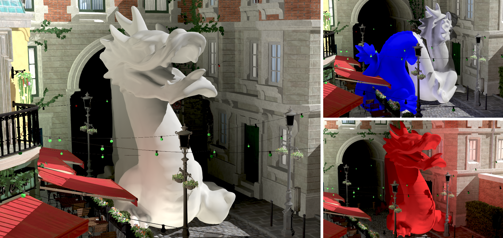

Dynamic voxel-based global illumination
=======================================

**NOTE: This project has been moved to https://bitbucket.org/Alex_Storm_/dvbgi please visit the new URL to access the whole project including source code and test scene**

This project contains a full implementation of the Dynamic voxel-based global illumination technique ( https://onlinelibrary.wiley.com/doi/10.1111/cgf.15262 ), including all the graphics framework written in C++ and Vulkan, and all the shaders needed for the technique.
**Disclaimer: This is an academic implementation, many parts can be largely improved, refactored, and there might be Vulkan validation layer errors pending to fix. It has only been tested on a NVIDIA RTX 2060 GPU.**

Build for Windows
-----------------

*Note: Unfortunately CMakeListst.txt does not fully automate the build process, with assimp and spirv-cross libraries precompiled for Visual Studio 2022. The spirv-cross code has been modified to allow better shader reflection funtionality, differing from the code in the original repository. Automatizing the build of those libraries to fully automate and build for any Windows platform is pending work.*

*Note: All dependencies needed for this project are included in the external.rar file which is uncompressed by CMake into the ./external folder, included Vulkan libraries. Vulkan version used is 1.2.162.1.*

* Clone / download the repository.
* Run CMakeListst.txt and select Visual Studio 2022 x64 bits as generator for the project.
* Open and compile the solution in Debug / Release modes (Release recommended).
* Copy ./external/assimp/dll/Debug/x64/assimpd.dll and ./external/assimp/dll/Release/x64/assimp.dll to build/Debug and build/Release respectively.

Controls
--------
* Arrows to move the camera.
* L to enable lighting.
* V to switch to voxel view.
* S to switch between main camera and emitter camera (which might be pointing away from the scene).

How to run
----------

* Run the project from the Visual Studio Solution with Ctrl + F5.

License
-------

The project is licensed under the Apache 2.0 license.
